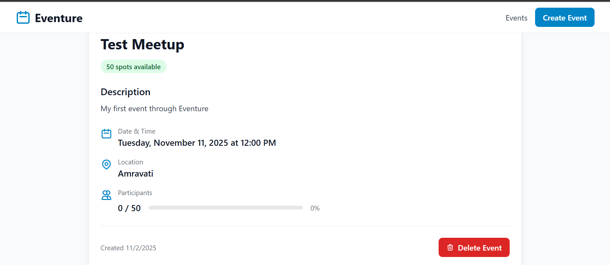
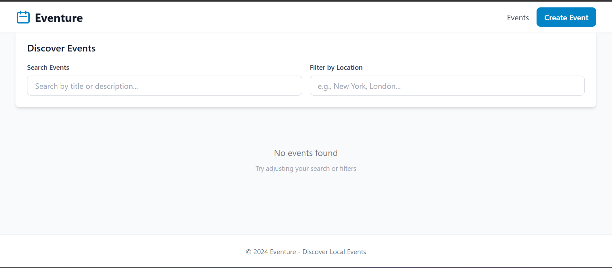
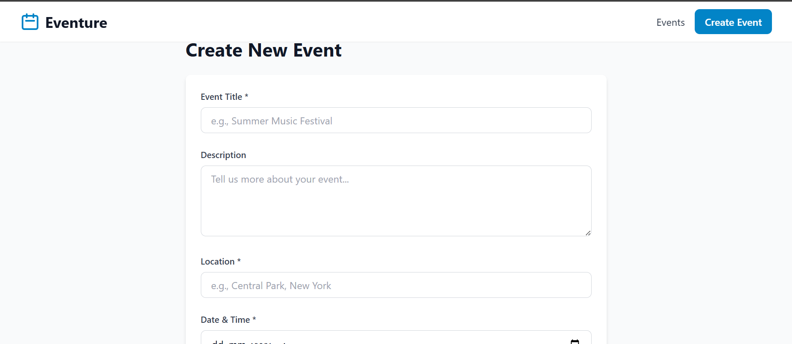
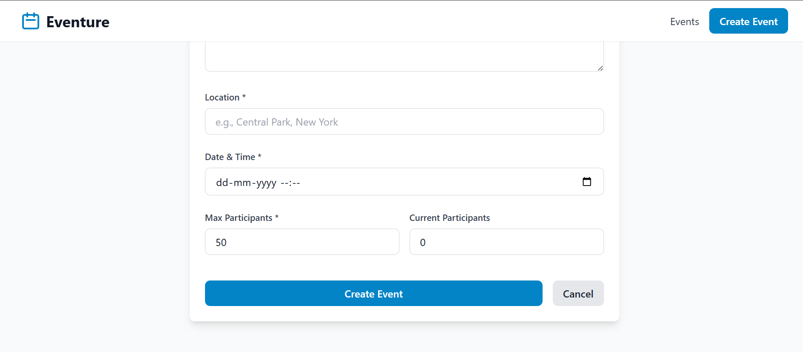
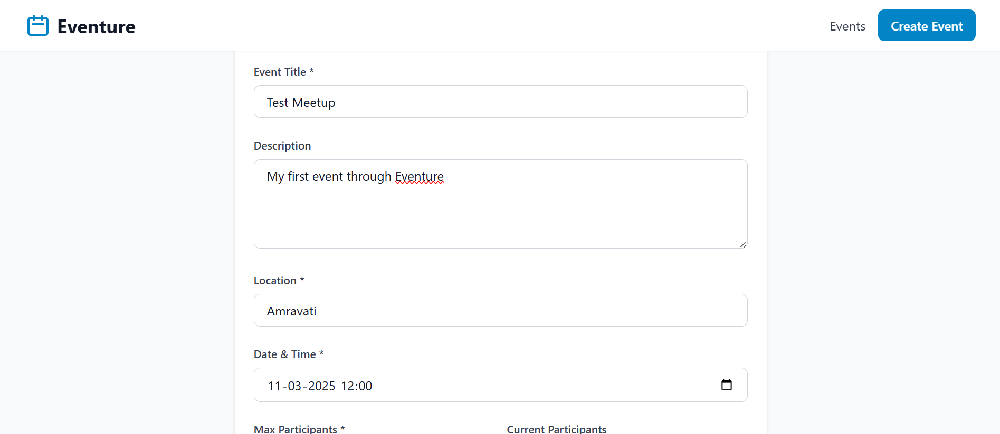
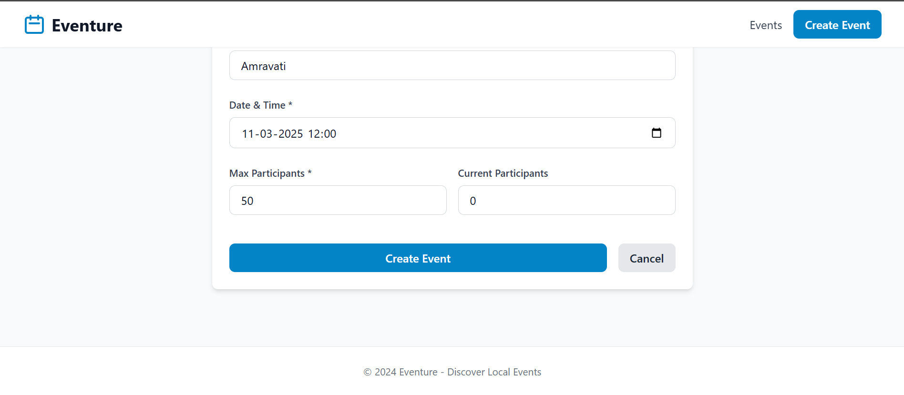
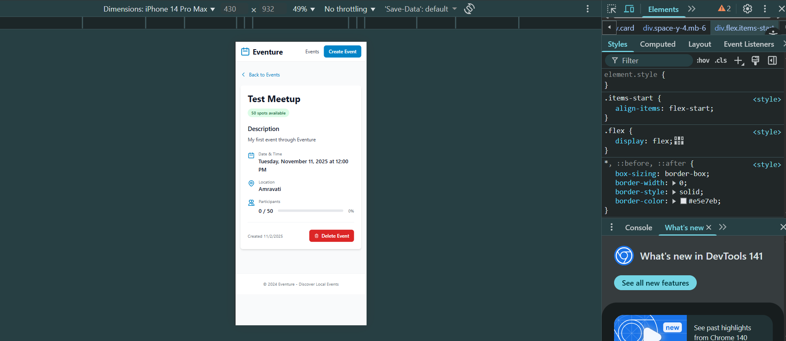

# 🎉 Eventure - Event Discovery App

A simple and modern web app to discover and create local events. Built with React, Node.js, and MongoDB.

## ✨ What is Eventure?

Eventure helps you:

- 🔍 **Find events** near you
- ➕ **Create new events**
- 📅 **View event details** (date, location, participants)
- 🔎 **Search and filter** events by location or keywords
- 🗑️ **Delete events** safely with confirmation dialog

## 🚀 Quick Start

### What You Need First

1. **Node.js** (v18+) - [Download here](https://nodejs.org/)
2. **MongoDB** - Use local MongoDB or free [MongoDB Atlas](https://www.mongodb.com/cloud/atlas)

### Step 1: Start the Backend

```bash
# Open Terminal/PowerShell
cd eventure-backend

# Install packages (first time only)
npm install

# Start the server
npm run dev
```

✅ You should see: `🚀 Server running on port 5000`

### Step 2: Start the Frontend

Open a **new** terminal window:

```bash
# Navigate to frontend folder
cd eventure-frontend

# Install packages (first time only)
npm install

# Start the app
npm run dev
```

✅ Open `http://localhost:5173` in your browser!

## 📁 Project Structure

```
Eventure/
├── eventure-backend/    # Server (Node.js + Express)
│   └── src/            # Backend code
│
├── eventure-frontend/   # Website (React)
│   └── src/            # Frontend code
│
└── assets/             # Screenshots
```

## 🛠️ Tech Stack

**Frontend (Website):**

- React - UI library
- TypeScript - Type safety
- Tailwind CSS - Styling
- Vite - Build tool

**Backend (Server):**

- Node.js - Runtime
- Express - Web framework
- MongoDB - Database
- TypeScript - Type safety

## 📝 Setting Up MongoDB

### Option 1: MongoDB Atlas (Recommended - Free Cloud Database)

1. Go to [MongoDB Atlas](https://www.mongodb.com/cloud/atlas)
2. Sign up for free account
3. Create a cluster (free tier available)
4. Get your connection string
5. Add it to `eventure-backend/.env`:
   ```
   MONGO_URI=your-connection-string-here
   ```

### Option 2: Local MongoDB

1. Install MongoDB on your computer
2. Start MongoDB service
3. Use default connection: `mongodb://localhost:27017/eventure`

## ⚙️ Configuration Files

### Backend `.env` file

Create `eventure-backend/.env`:

```env
PORT=5000
MONGO_URI=mongodb://localhost:27017/eventure
NODE_ENV=development
FRONTEND_URL=http://localhost:5173
```

### Frontend `.env` file (Optional)

Create `eventure-frontend/.env`:

```env
VITE_API_URL=http://localhost:5000/api
```

## 🎯 How to Use

1. **View Events**: Home page shows all available events
2. **Search**: Use search bar to find events by title or description
3. **Filter**: Filter events by location
4. **Create Event**: Click "Create Event" button to add new events
5. **View Details**: Click any event card to see full details
6. **Delete Event**: See the [Delete Functionality](#-delete-functionality) section below for details

## 🗑️ Delete Functionality

Eventure includes a safe and intuitive delete feature for managing events:

### Features:

- **Confirmation Dialog**: A confirmation popup prevents accidental deletions
- **Visual Feedback**: Loading spinner shows while the event is being deleted
- **Success Notification**: Toast notification confirms successful deletion
- **Auto-redirect**: Automatically returns to the events list after deletion
- **Error Handling**: Clear error messages if deletion fails

### How to Delete an Event:

1. Navigate to any event's detail page by clicking on an event card
2. Scroll down to the bottom of the event details
3. Click the red **"Delete Event"** button
4. Confirm the deletion in the popup dialog
5. The event will be permanently removed and you'll be redirected to the events list


_Event detail page showing the delete button (bottom right)_

### Technical Details:

- **Backend API**: `DELETE /api/events/:id`
- **Safety**: Confirmation required before deletion
- **Response**: Returns success message and deleted event data
- **Error Handling**: Handles invalid IDs and network errors gracefully

## 📸 Screenshots

Here are screenshots showcasing the Eventure application:

### 🏠 Home Page


_Event discovery page with search and filter functionality - Shows empty state with helpful message when no events are found_

### ➕ Create Event Form


_Create event form - Initial view with all input fields_


_Create event form - Example with filled data showing form validation_

### 📅 Event Detail Pages


_Event detail page - Complete event information display_


_Event detail page - Shows event metadata and participant information_


_Event detail page - Displays the red "Delete Event" button at the bottom right, demonstrating the delete functionality_

### 📱 Mobile Responsive View


_Responsive design on mobile devices - iPhone 14 Pro Max view showing the mobile-optimized layout with delete button visible_

---

💡 **Note**: All screenshots are available in the [`assets/`](./assets/) folder. The delete functionality is visible in the event detail screenshots.

## 🐛 Troubleshooting

### Backend won't start?

- Make sure MongoDB is running
- Check if port 5000 is available
- Verify `.env` file exists

### Frontend can't connect?

- Make sure backend is running on port 5000
- Check browser console for errors
- Verify `VITE_API_URL` in frontend `.env`

### MongoDB connection error?

- Check your connection string
- For Atlas: verify IP whitelist settings
- Make sure MongoDB service is running (if local)

See [`TROUBLESHOOTING.md`](./TROUBLESHOOTING.md) for more help.

## 📚 Available Scripts

### Backend

```bash
npm run dev    # Start development server
npm run build  # Build for production
npm start      # Run production build
```

### Frontend

```bash
npm run dev     # Start development server
npm run build   # Build for production
npm run preview # Preview production build
```

## 🚢 Deployment

### Backend → Render

1. Connect GitHub repository
2. Set build command: `npm install && npm run build`
3. Set start command: `npm start`
4. Add environment variables

### Frontend → Vercel

1. Connect GitHub repository
2. Set build command: `npm run build`
3. Set output directory: `dist`
4. Add environment variable: `VITE_API_URL`

## 📖 Documentation

- **Backend Details**: [`eventure-backend/README.md`](./eventure-backend/README.md)
- **Frontend Details**: [`eventure-frontend/README.md`](./eventure-frontend/README.md)
- **Setup Guide**: [`SETUP_GUIDE.md`](./SETUP_GUIDE.md)
- **GitHub Setup**: [`GITHUB_SETUP.md`](./GITHUB_SETUP.md)

## 🎓 What I Learned

- Full-stack development with MERN stack
- RESTful API design
- TypeScript for both frontend and backend
- MongoDB database design
- Error handling and validation
- React hooks and modern patterns

## 🤝 Contributing

This is a portfolio project, but suggestions are welcome!

---

## 💡 Need Help?

1. Check the [Troubleshooting Guide](./TROUBLESHOOTING.md)
2. Review the [Setup Guide](./SETUP_GUIDE.md)
3. Read the detailed README files in `eventure-backend/` and `eventure-frontend/`

---

_A simple, clean event discovery application demonstrating full-stack development skills._
